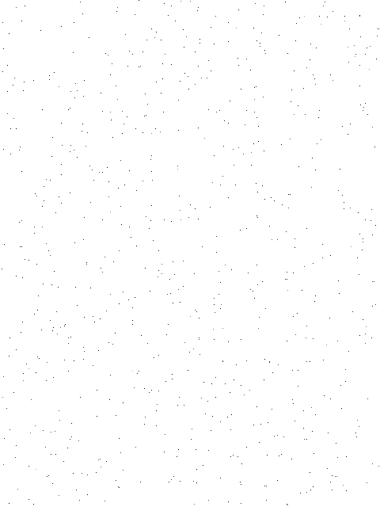
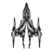

# Javascript-Capstone Project: Build a Shooter Game

<h1 align="center">
  Space War
</h1>

> Capstone project in the Microverse JavaScript Curriculum

Implementation of a Space Shooter Game built with the [Phaser 3](https://phaser.io/phaser3) framework

## About The Project

The main goal of this project is to build a platform game. Phaser and Javascript are the main technologies used to develop this project.

Live version of the project: [Live version](https://shooting-necmi.herokuapp.com/)

Project Link: [Javascript-Capstone](https://github.com/necmigunduz/phaser-js-game)

## The game

This is a never-ending game. User faces different alien ships at random times. User uses laser (Space) to shoot and explode enemy ships. Every different enemy ship shot adds a differnet point to the user's score. When the user's ship is shot by an enemy laser, or an enemy ship touches the user's ship, the game ends. The user can restart the game. Also, users' high scores are stored in an API, and users can display the highest ten scores in the scoreboard scene.

### Game design

The game uses one laser sprite, one user ship, four enemy ships, and two backgrounds. Two backgrounds are displayed on each other to create a more interesting background and higher contrast. The user ship is black and white to have a high contrast with the background. The enemy ships have fantastic desings, and they are relatively more colored to create a confusion with the dark background with low contrast. There is a background music, and an explosion sound in the game. 

# Background Images
- First Background:

- Second Background:

# User Ship

# Enemy ships
- Chaser Ship

- Carrier Ship

- Gun Ship

- Hollow Ship

# Laser

# Explosion Sprite

### How to Play

- Input your name on the first page and click the submit button, There is a menu on the next page which are Play, Options, Credits and Scoreboard. You can disable the sound in the options menu. Click on the play menu to start your game. You can move around the screen using W, S, D, and A keys and use the Space Bar to shoot whenever you see an enemy.

#### Get a local copy

_npm required_ - [get npm](https://www.npmjs.com/get-npm)

### Installation

You can play the game on [live version](https://shooting-necmi.herokuapp.com/), or install it locally using the following steps:

**Clone the repository by running this command in your terminal**

`$ git clone git@github.com:necmigunduz/phaser-js-game.git`

**Navigate into the newly created folder**

`$ cd phaser-js-game`

#### Get the dependencies needed for the game

`$ npm install`

#### Start the server

`$ npm start`

**Visit this link to see the game in your browser**

`http://localhost:8080/`

**Run Jest tests**

`$ npm run test`

## Technologies used

- HTML5/CSS
- Phaser 3
- Webpack
- Javascript
- Eslint
- Babel
- Jest for testing
- [Heroku](https://www.heroku.com/) for deployment
- [Leaderboard API service](https://us-central1-js-capstone-backend.cloudfunctions.net/api/games/bFQvTZfPrvjkHOOILnoM/scores/) for high scores

## Author

👤 **Necmi Gunduz**

- LinkedIn: [Necmi Gunduz](https://www.linkedin.com/in/necmigunduz/)
- Github: [@necmigunduz](https://github.com/necmigunduz/)
- Twitter: [@necmigunduz](https://twitter.com/necm_gun)
- Mail: [necmigunduz@gmail.com](necmigunduz@gmail.com)

## Contributing

Contributions, issues and feature requests are welcome!

Feel free to check the [issues page](https://github.com/necmigunduz/phaser-js-game/issues).

## Show your Support

Give a ⭐️ if you like this project!

## Acknowledgments

- [Microverse](https://www.microverse.org/)
- [Phaser](https://phaser.io/)
- [OpenGameArt](https://opengameart.org/)
- [https://learn.yorkcs.com/](https://learn.yorkcs.com/)